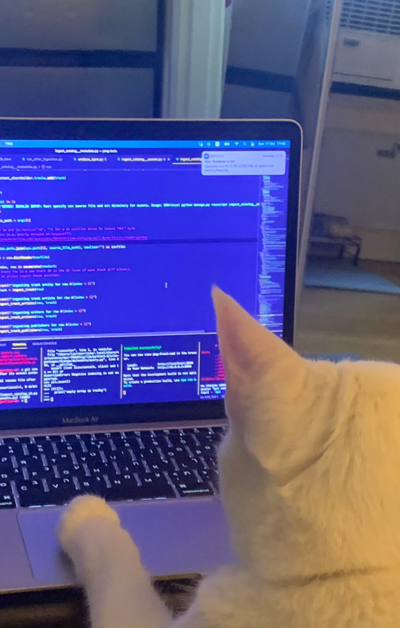
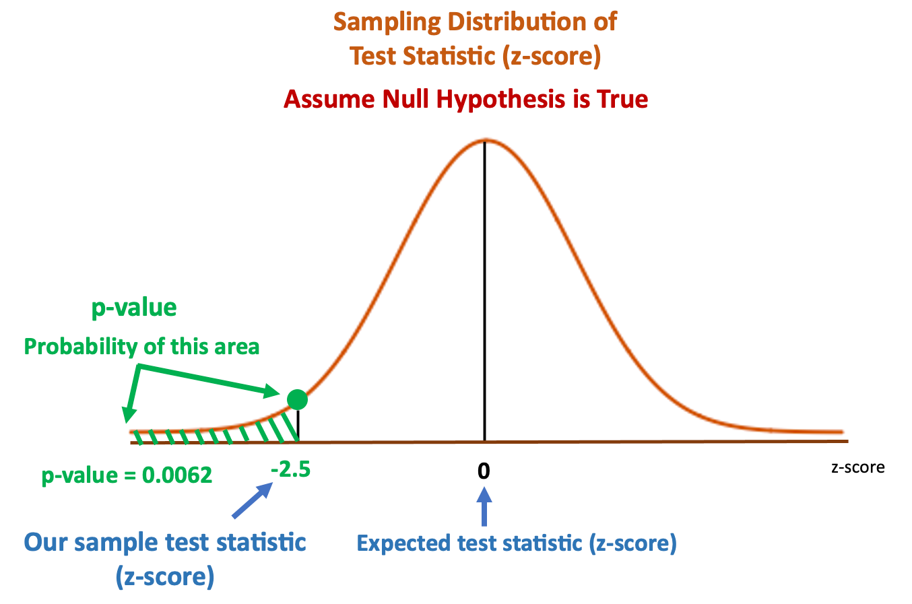
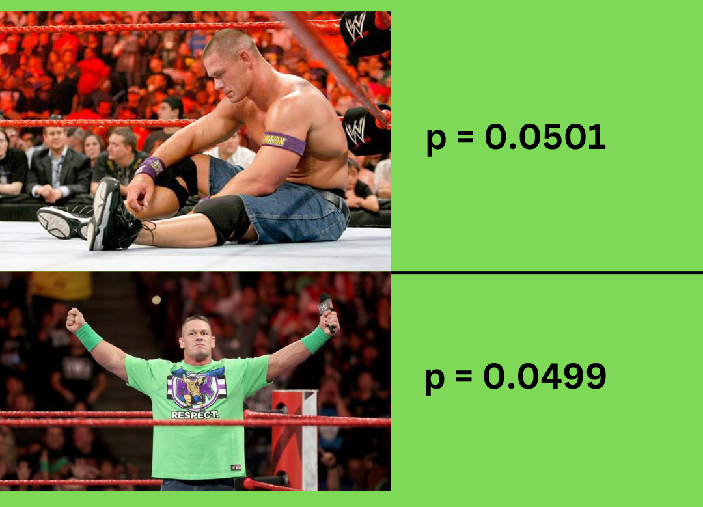
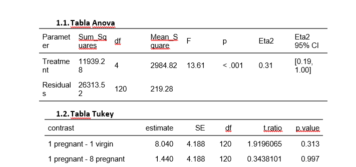
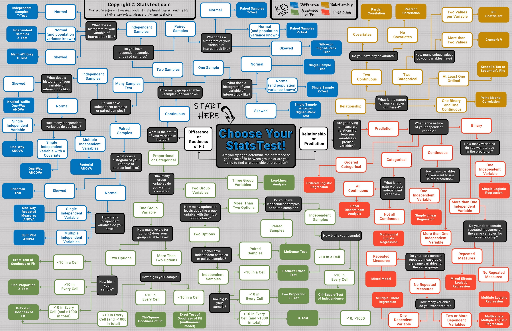

## 

::: columns
::: {.column width="37.5%"}
{style="margin-left:-60px"}
:::

::: {.column width="60%"}
::: {.title data-id="title"}
Módulo 5: Introducción a la Estadística Inferencial con R
:::

Mauricio Moreno, PhD
:::
:::

{.image-left}

## Generalidades {.smaller}

::: incremental
-   Uno de los objetivos de este curso es el evitar en la medida de lo posible el adentrarnos en teoría estadística. Entre los temas que dejaremos de lado están:

    -   Teoría de la probabilidad básica

    -   Ley de los números grandes

    -   Distribución muestral (o de muestreo)

    -   Teorema del límite central
    
    -   Valores críticos de una prueba

    -   Descripción a detalle de la distribución normal

    -   Descripción a detalle de otras distribuciones

-   Para quién esté interesado en un recurso para ver estos temas a profundidad, recomiendo el libro de [Danielle Navarro: *Learning Statistics with R*](https://learningstatisticswithr.com/){target="_blank"}

:::

<!-- ## Pasos básicos en un protocolo estadístico -->

<!-- De manera muy general: -->

<!-- ::: incremental -->

<!-- 1.    Determinar el tipo de estudio a realizar -->

<!-- 2.    Establecer una hipótesis -->

<!-- 3.    Listar métodos o modelos estadísticos para analizar los datos -->

<!-- 4.    Decidir sobre el diseño experimental a implementar y sus requerimientos -->

<!-- ::: -->

# Definiciones básicas

## Muestras, poblaciones y muestreos

::: incremental
-   **Muestra**: Es un conjunto de observaciones que provienen de una población de interés. Idealmente, esta debería ser lo suficientemente grande para hacer inferencias de esa población.

-   **Población**: Es el conjunto de todas las posibles observaciones de las que tengamos interés en realizar inferencias. Es vital el definir adecuadamente sus características.

-   **Muestreo**: Es el proceso por el cual obtendremos nuestra muestra para un estudio. En estudios experimentales, el muestreo se entiende también como el proceso de aleatorización/randomización de unidades experimentales.
:::

## Muestreo simple sin reemplazo

{target="_blank"}](images/simple1.png){fig-align="center" width="900"}

## Muestreo simple con reemplazo

{target="_blank"}](images/simple2.png){fig-align="center" width="1020"}

## Otros tipos de muestreo

::: incremental
-   **Muestreo sistemático**: consiste en tomar un determinado elemento de la población siguiendo un patrón. Por ejemplo, escoger los múltiplos de cuatro enumerados en una lista de posibles individuos de estudio (solía ser una práctica común en ensayos clínicos).

-   **Muestreo a conveniencia**: consiste en incluir en el estudio a todos los elementos disponibles de la población de interés. Esto sucede sobre todo con poblaciones escasas o de dificil acceso (ejemplo, realizar estudios en comunidades LGBTIQ+).

-   **Muestreo estratificado**: es una combinación del muestreo simple con los sujetos agrupados por alguna característica en común, por ejemplo sexo, edad, hábitat (suele ser usado en exit polls y conteos rápidos).
:::

## Parámetros poblacionales y estadísticos muestrales

::: incremental

-   Parámetros poblacionales: llamados también verdaderos. Corresponden al escenario en que todos los individuos de una población podrían ser medidos con respecto a una característica.
    
-   Estadísticos muestrales: son aproximaciones de los parámetros verdaderos que corresponden a mediciones de una muestra de la población.

-   La estadística gira alrededor de la inferencia sobre estadísticos muestrales, ya que en el práctica, los parámetros poblacionales son prácticamente imposibles de determinar.

:::

## Media aritmética {.smaller}

| Símbolo        | ¿Qué es?                                        | ¿Sabemos qué es?              |
|----------|------------------------------------|----------------------|
| $\overline{X}$ | Media aritmética de la muestra                  | Calculada de los datos        |
| $\mu$          | Verdadera media aritmética de la población      | Casi nunca es conocida        |
| $\hat{\mu}$    | Estimado de la media aritmética de la población | Sí, identica a $\overline{X}$ |

$$
\overline{X} = \frac{1}{n}\sum^{n}_{i=1}\left(X_i\right)
$$

## Desviación estándar {.smaller}


| Símbolo        | ¿Qué es?                                          | ¿Sabemos qué es?           |
|---------|---------------------------------------|---------------------|
| $s$            | Desviación estándar de la muestra                 | Calculada de los datos     |
| $\sigma$       | Verdadera desviación estándar de la población     | Casi nunca es conocida     |
| $\hat{\sigma}$ | Estimado de la deviación estándar de la población | Sí, pero no es igual a $s$ |

::: columns
::: {.column width="50%"}
$$
s = \sqrt{\frac{1}{n} \sum_{i=1}^n (X_i - \overline{X})^2} 
$$
:::

::: {.column width="50%"}
$$
\sigma = \sqrt{\frac{1}{n-1} \sum_{i=1}^n (X_i - \overline{X})^2} 
$$
:::
:::

## Varianza {.smaller}


| Símbolo          | ¿Qué es?                                | ¿Sabemos qué es?             |
|----------|-------------------------------|------------------------|
| $s^2$            | Varianza de la muestra                  | Calculada de los datos       |
| $\sigma^2$       | Verdadera varianza de la población      | Casi nunca es conocida       |
| $\hat{\sigma}^2$ | Estimado de la varianza de la población | Sí, pero no es igual a $s^2$ |

::: columns
::: {.column width="50%"}
$$
s^2 = \frac{1}{n} \sum_{i=1}^n (X_i - \overline{X})^2
$$
:::

::: {.column width="50%"}
$$
\sigma^2 = \frac{1}{n-1} \sum_{i=1}^n (X_i - \overline{X})^2 
$$
:::
:::

## Intervalos de confianza {.smaller}

::: incremental
-   Los estimados de las verdaderas $\mu$ y $\sigma$ ($\hat{\mu}$ y $\hat{\sigma}$) provienen de distribuciones de muestreo, y como tales, inherentemente poseen cierto grado de incertidumbre.

-   Los intervalos de confianza son medidas que nos permiten tener una idea de esa incertidumbre.

-   En el estudio de la distribución normal estándar tenemos el conocimiento que existe un 95% de chances que una cantidad normalmente distribuida colectada al azar, estará distante de la media aritmética entre $\pm$ 1.96 desviaciones estándar.
:::

. . .

$$
\overline{X} - \left(1.96\times\frac{\sigma}{\sqrt{n}}\right) \leq \mu \leq \overline{X} + \left(1.96\times\frac{\sigma}{\sqrt{n}}\right)
$$

::: incremental
-   Y se interpreta como: **con un 95% de confianza, podemos esperar que la media aritmética verdadera de la población de interés se encuentra contenida entre...**
:::

. . .

$$
\text{IC}_{95}=\overline{X} \pm \left(1.96\times\frac{\sigma}{\sqrt{n}}\right) 
$$

## Intervalos de confianza {.smaller visibility="uncounted"}

::: incremental
-   Sin embargo, como mencionamos $\sigma$ es casi nunca conocido, y es necesario hacer una corrección a la fórmula anterior. La distribución normal trabaja bien baja la presunción de un número grande de observaciones.

-   En su lugar, en 1908 el estadístico [Gosset](https://en.wikipedia.org/wiki/Student%27s_t-distribution){target="_blank"} parametrizó una distribución para muestras pequeñas que asemeja a la normal. Con el tiempo, esta distribución adoptó el nombre de *Student*.

-   Y es precisamente que la fórmula anterior es corregida con la distribución de Student y así poder calcular intervalos de confianza para muestras pequeñas usando $s$ en lugar de $\sigma$:
:::

. . .

$$
\text{IC}_{95}=\overline{X} \pm \left(t_{n-1,\alpha/2}\times\frac{s}{\sqrt{n}}\right) 
$$

::: incremental
-   Donde el valor $t_{n-1,\alpha/2}$ refiere a:

    -   $n-1$: los grados de libertad, igual al número de observaciones $n$ de la muestra, menos 1

    -   $\alpha$: es el nivel de significancia (probabilidad de obtener un resultado erróneo por azar).

    -   Estos valores en el pasado se encontraban tabulados en libros de texto, hoy contamos con R!
:::

## Ejemplo de parámetros poblacionales y estadísticos muestrales

::: incremental
-   Supongamos que el IQ de toda una población puede estar caracterizado por una media aritmética, $\mu$, igual a 100, con una desviación estándar, $\sigma$, igual a 15.

-   Si tomo una muestra de 100 individuos de dicha población, podría tener una media aritmética de esta muestra, $\overline{X}$, igual a 101.4 y una desviación estándar de la muestra, $s$, igual a 13.7.

-   Así $\overline{X}$ y $s$ son aproximaciones a los valores verdareros de $\mu$ y $\sigma$ de esa población.
:::

## Ejemplo de parámetros poblacionales y estadísticos muestrales {.smaller visibility="uncounted"}

::: incremental
-   Supongamos que en lugar de tener acceso al IQ de 100 personas, medimos al azar el IQ de sólamente 5 personas y deseamos calcular el $\text{IC}_{95}$
:::

. . .

```{r echo=T, eval=T, error=T}
#| code-line-numbers: "1|2|3|4|5|6|7"
IQ_muestra <- c(101, 98, 116, 96, 129)   # muestra
n <- 5                                   # número de observaciones
t95 <- qt(p = 0.975, df = n -1)          # valor de Student para 4 grados de libertad al 5%
x <- mean(IQ_muestra)                    # media aritmética de la muestra
s <- sd(IQ_muestra)                      # desviación estándar de la muestra
ls <- x + (t95*s/(n-1))                  # límite superior del IC95
li <- x - (t95*s/(n-1))                  # límite inferior del IC95
```

## Intervalos de confianza {autoanimate="true" visibility="uncounted" .smaller}

-   Supongamos que en lugar de tener acceso al IQ de 100 personas, medimos al azar el IQ de sólamente 5 personas y deseamos calcular el $\text{IC}_{95}$

```{r echo=T, eval=T, error=T}
#| code-line-numbers: "8"
IQ_muestra <- c(101, 98, 116, 96, 129)   # muestra
n <- 5                                   # número de observaciones
t95 <- qt(p = 0.975, df = n -1)          # valor de Student para 4 grados de libertad al 5%
x <- mean(IQ_muestra)                    # media aritmética de la muestra
s <- sd(IQ_muestra)                      # desviación estándar de la muestra
ls <- x + (t95*s/(n-1))                  # límite superior del IC95
li <- x - (t95*s/(n-1))                  # límite inferior del IC95
print(paste0("Con un 95% de confianza podemos esperar que la verdadera media aritmética de IQ de esta población se encuentre entre [",round(li,0),", ",round(ls,0),"]"))
```

## Hipótesis de investigación vs. hipótesis estadísticas {.smaller}

::: incremental
-   Una hipótesis de investigación gira alrededor del desarrollar una conclusión científica acerca de un tema de interés del investigador. Ejemplos: *el fumar causa cáncer*, *las vacunas causan/previenen enfermedades*.

    -   Es decir, pueden tener una naturaleza subjetiva, que expresan la pregunta del investigador de una manera general sin mayor descripción del ¿cómo? voy a probar o descartarla, ni ¿en qué extensión?.

-   Hipótesis estadísticas, por el contrario, deben ser matemáticamente precisas y basadas en las características de los datos que recolectemos con el fin de probar o descartar la hipótesis de investigación.

    -   Cómo es de esperar, el probar o descartar una hipótesis estadística será únicamente válida para la población sobre la cual una muestra fue tomada.

    -   Es ahí donde radica la importancia en definir la población sujeto de estudio de manera planificada con el objetivo de que cumpla tantos detalles sean necesarios de la hipótesis de investigación. Ejemplo, el modelo animal más usado es el ratón. Si bien es cierto constituye uno de los primeros pasos en el desarrollo de muchas investigaciones, los hallazgos en ratones NO pueden ser inmediatamente atribuibles a suceder en seres humanos.
:::

## Hipótesis nula y alternativa {.smaller}

::: incremental
-   La formulación de hipótesis estadísticas puede reducirse a establer preguntas de investigación en forma de las hipótesis nula y alternativa.

-   Supongamos que tenemos dos grupos experimentales para probar la eficiencia de un nuevo procedimiento quirúrgico. Un grupo de pacientes será sometido a la intervención tradicional (control), y el otro grupo al nuevo procedimiento (experimental).

    -   La hipótesis nula ($H_0$) establece que: no existe diferencia entre el grupo control y el grupo experimental,

    -   Mientras que la hipótesis alternativa ($H_a$) establece que: sí existe differencia entre ambos.
:::

. . .

```{=tex}
\begin{align}
H_0& : \mu_c = \mu_e& H_0& : \mu_c- \mu_e =0 \\
H_a& : \mu_c \neq \mu_e& H_a& : \mu_c- \mu_e \neq 0
\end{align}
```
## Tipos de errores

::: incremental
-   Al llevar a cabo pruebas de hipótesis pueden ocurrir errores
:::

. . .

```{r setup, include=FALSE}
knitr::opts_chunk$set(echo = FALSE)
library(xtable)
```

```{r, results='asis'}
dat <- data.frame(
  " " = c("H_{0}\\text{ es verdadera}", "H_{0}\\text{ es falsa}"),
  "\\text{Acepta }H_{0}" = c("\\text{Desición correcta}", "\\text{Error tipo II}"),
  "\\text{Rechaza }H_{0}" = c("\\text{Error tipo I}", "\\text{Desición correcta}"),
  check.names = FALSE
)

M <- print(xtable(dat, align=rep("|c|", ncol(dat)+1)), 
           floating = FALSE, tabular.environment="array", 
           comment=FALSE, print.results=FALSE, 
           include.rownames = FALSE,
           sanitize.text.function = function(x) x)
cat(M)
```

. . .

-   ¿De qué depende que aceptemos correctamente o no la hipótesis nula?

. . .

Las pruebas estadísticas dependen de la cantidad de variación y la diferencia entre tratamientos a detectar (**tamaño del efecto**). La solución: aumentar el número de observaciones

## Poder de una prueba estadística {.smaller}

::: incremental
-   El poder de una prueba estadística es la probabilidad de rechazar la hipótesis nula cuando esta es de hecho falsa.

-   Se puede derivar de la tabla anterior
:::

. . .

```{r, results='asis'}
dat <- data.frame(
  " " = c("H_{0}\\text{ es verdadera}", "H_{0}\\text{ es falsa}"),
  "\\text{Acepta }H_{0}" = c("1-\\alpha\\text{ (Prob. decisión correcta)}", "\\beta\\text{ (Taza Error tipo II)}"),
  "\\text{Rechaza }H_{0}" = c("\\alpha\\text{ (Taza Error tipo I)}", "1-\\beta\\text{ (Poder)}"),
  check.names = FALSE
)

M <- print(xtable(dat, align=rep("|c|", ncol(dat)+1)), 
           floating = FALSE, tabular.environment="array", 
           comment=FALSE, print.results=FALSE, 
           include.rownames = FALSE,
           sanitize.text.function = function(x) x)
cat(M)
```

. . .

-   En la práctica, existen fórmulas cerradas para la determinación del número mínimo de observaciones para alcanzar un poder adecuado ($\ge$ 80%)

-   A este procedimiento se le conoce como análisis de poder o determinación del tamaño de la muestra y del que hablaremos en más detalle más adelante.

## Tamaño del efecto {.smaller}

::: incremental
-   El tamaño del efecto ($\theta$) es un valor que por lo general es determinado por el investigador y que puede ser la diferencia de interés a detectar en una prueba estadística.

-   Por ejemplo, supongamos que tenemos un grupo de ratones que poseen una media de 110 mg/dL de glucosa en sangre y podrían ser parte de un linaje para ser usado como modelo para hiperglucemia. Si el valor normal de glucosa en ratones es de 100 mg/dL, el investigador estaría interesado en saber cuál es el número de ratones necesarios para con un 80\% de poder, determinar si el tamaño de efecto $\theta = 10$ es estadísticamente distinto de 0.

-   Las hipótesis de esta prueba se vería así
:::

. . .

```{=tex}
\begin{align}
H_0& : \mu_c- \mu_r = \theta \\
H_a& : \mu_c- \mu_r \neq \theta
\end{align}
```

. . .

-   Esta hipótesis corresponde a la prueba estadística más común: *dos colas*

## Pruebas de dos colas

```{=tex}
\begin{align}
H_0& : \mu_c- \mu_r = \theta \\
H_a& : \mu_c- \mu_r \neq \theta
\end{align}
```
{target="_blank"}](images/dcolas.gif){fig-align="center" width="400"}

## Pruebas de una cola

```{=tex}
\begin{align}
H_0& : \mu_c- \mu_r \ge \theta \\
H_a& : \mu_c- \mu_r < \theta
\end{align}
```
{target="_blank"}](images/ucolagreat.gif){fig-align="center" width="400"}

## Pruebas de una cola {visibility="uncounted"}

```{=tex}
\begin{align}
H_0& : \mu_c- \mu_r \le \theta \\
H_a& : \mu_c- \mu_r > \theta
\end{align}
```
{target="_blank"}](images/ucolaless.gif){fig-align="center" width="400"}

## El valor p {.smaller}

::: columns
::: {.column width="40%"}

::: incremental
-   Pero ¿cómo sabemos si una hipótesis es aceptada o rechazada?

-   El valor p, describe que tan probable sería observar resultados de la prueba asumiendo que la hipótesis nula no hubiese sido rechazada. Por ello, a menores valores p, mayor la diferencia estadística con respecto a la hipótesis alternativa.

-   El valor p también depende de que tan "estricta" queramos sea la prueba, y esto se define con el grado de significancia (usualmente igual a 5\%, y a 1\%)
:::
:::

::: {.column width="60%"}


{fig-align="center"}
:::
:::

:::footer
Imagen tomada de [*Towards DataScience*](https://towardsdatascience.com/what-is-p-value-370056b8244d){target="_blank"}
:::

## Antes de continuar

{fig-align="center"}

::: footer
Imagen tomada de [aquí](https://arbor-analytics.com/post/2022-10-10-p-ing-in-the-woods-p-values-in-forest-science/){target="_blank"}
:::

## Antes de continuar {.smaller visibility="uncounted"}

::: incremental
-   El umbral de 0.05 es una convención arbitraria [creada por Fischer](https://www.bmj.com/rapid-response/2011/11/03/origin-5-p-value-threshold#:~:text=statistician%20RA%20Fisher%20in%201926%20%5B1%5D.){target="_blank"} en los inicios de la estadística moderna.

-   Lastimosamente, se ha generalizado la idea de que por más mínima sea la diferencia con respecto a 0.05, esta representa la diferencia entre publicar o no (en el campo académico), entre lanzar o no un nuevo fármaco/producto al mercado (en la industria).

-   En 2014, debido a un fallo de la [corte suprema de justicia de los Estados Unidos](https://www.ncbi.nlm.nih.gov/pmc/articles/PMC5017929/#:~:text=A%20statistically%20significant%20test%20result,that%20no%20effect%20was%20observed.){target="_blank"} que le dio la potestad a los inversionistas de farmaceúticas a demandarlas por fallar en reportar efectos secundarios de sus productos a pesar de haber sido hallados estadísticamente no significativos, la Asociación Americana de Estadística (ASA) se vio en la necesidad de definir más exhaustivamente el concepto del valor p.

-   Entre las recomendaciones de la ASA, se enfatizó el dar mayor prioridad a la estimación de otros estadísticos complementarios al valor p, tales como intervalos de confianza u otros provenientes de la estadística Bayesiana (intervalos de credibilidad, factores de Bayes).

-   Esta última (estadística Bayesiana), ofrece una interpretación más natural al referirnos a los resultados en términos de probabilidades y no en números arbirtrarios como el valor p.

-   En resumen, una investigación no es inútil si el valor p sobrepasa o está por debajo de 0.05 por cantidades pequeñas.
:::

## Antes de continuar {.smaller .smaller visibility="uncounted"}

::: incremental
-   En su lugar, en escenarios en que el valor p está alejado por una décima o varias centésimas de 0.05, los resultados deberían interpretarse como indeterminados para generalizar sobre la población objeto de estudio y específicos a las condiciones experimentales (análisis estadísticos, instrumentos de medición, etc) bajo las cuales fueron tomadas y modeladas las mediciones.

-   En el contexto de los modelos estadísticos que veremos más adelante, esto ha derivado en un "temor" del investigador cuando los resultados no pasan los chequeos de los supuestos sobre los que estos modelos se cimentan. Sobre todo cuando el valor p dista de 0.05 por ínfimas cantidades.

-   Esto puede llevar a malas prácticas científicas tales como: no reportar el resultado de los chequeos, blindar los datos, escoger "outliers" y removerlos y en el peor de los casos, manipular los datos para tratar de acomodar nuestros datos a estos chequeos.

-   Todo lo que he mencionado, no solamente constituyen casos de mala conducta científica, sino lo que hoy en día se le conoce como *p hacking* (que se puede resumir a torturar los datos hasta que nos confiesen una verdad agradable a nuestros propósitos).
:::

# Pruebas estadísticas paramétricas

## Pruebas t {.smaller}

::: incremental
-   Las pruebas t son usadas para encontrar la diferencia entre dos medias aritméticas.

-   La $H_0$ en estas pruebas es que las medias aritméticas son las mismas.

-   Se rechaza la $H_0$ cuando el valor p resultante es $<$ 0.05

-   Existen tres tipos de pruebas t

    -   Pruebas t de una muestra

    -   Pruebas t de muestras independientes

    -   Pruebas t de muestras emparejadas

-   Estas pruebas fueron desarrolladas bajo la suposición de la **normalidad** y de **homogeneidad de las varianzas**.

-   De acuerdo al teorema del límite central, muestras grandes casi aseguran la normalidad.

-   Cuando el número de observaciones en una muestra es pequeño, es recomendable llevar a cabo un test de normalidad para decidir si es posible una prueba t o una de sus alternativas.
:::

## Normalidad de una muestra

::: incremental
-   Antes de llevar a cabo las pruebas t, hemos mencionado sus supuestos. Por ello, es aconsejable el siempre realizar estas pruebas antes de usarlas.

-   Existen dos tipos de pruebas para establecer si una muestra es normalmente distribuida o no

    -   Indirectamente: gráfico Q-Q

    -   Prueba formal de normalidad (ejemplo: Shapiro-Wilk)

-   **En el caso del ANOVA**, es importante enfatizar que estas pruebas no necesariamente tienen que hacerse antes de la prueba, como ya veremos más adelante.
:::

## Gráfico Q-Q

::: incremental
-   El gráfico Q-Q es una prueba visual indirecta de la normalidad.

-   Consiste en crear un gráfico de dispersión entre los valores observados de una muestra vs. los valores que deberían estos tener si siguieran una distribución normal.

-   Mientras en el gráfico de dispersión los puntos más se distribuyan a lo largo de una diagonal, más cercanos están los datos de la muestra a seguir un distribución normal.

-   Su desventaja es que es muy subjetivo, y a menudo requiere una prueba formal para poder confirmarlo.
:::

## Gráfico Q-Q {visibility="uncounted"}

```{r echo=T, eval=F, error=T, fig.width=6, fig.align='center'}
#| code-line-numbers: "1|2|3"
set.seed(123)
y <- rnorm(n = 30, mean = 0, sd = 1)  # simulamos 30 observaciones de una normal estandar
qqnorm(y)                             # producimos el gráfico Q-Q
```

## Gráfico Q-Q {visibility="uncounted"}

```{r echo=T, eval=T, error=T, fig.width=6, fig.align='center'}
set.seed(123)
y <- rnorm(n = 30, mean = 0, sd = 1)  # simulamos 30 observaciones de una normal estandar
qqnorm(y)                             # producimos el gráfico Q-Q
```

## Prueba de normalidad Shapiro-Wilk

::: incremental
-   La $H_0$ de esta prueba (y del resto de pruebas formales de normalidad) es que un set de $n$ observaciones es normalmente distribuido.

-   Otro conocido método es Kolmogorov-Smirnov. Sin embargo, Shapiro-Wilk es más apropiado para cuando el número de muestras es menor a 50.

-   Para ilustrar su uso, chequeemos la normalidad de los datos que simulamos anteriormente
:::

. . .

```{r echo=T, eval=T, error=T, fig.width=6, fig.align='center'}
shapiro.test(y)
```

## Prueba de homogeneidad de las varianzas {.smaller}

::: incremental
-   En el caso de comparaciones entre las medias de dos grupos, la homogeneidad de varianzas puede chequearse usando la prueba F.

-   La prueba t de una muestra no requiere chequear este supuesto.

-   Para ilustrar su uso, creemos otro vector con datos simulados. En este caso, un igual número de observaciones con la misma desviación estándar pero diferente media:
:::

. . .

```{r echo=T, eval=T, error=T, fig.width=6, fig.align='center'}
set.seed(123)
x <- rnorm(n = 30, mean = 4, sd = 1)
var.test(x, y)
```

## Supuestos en la práctica {.smaller}

```{r echo=T, eval=F, error=T}
install.packages("UsingR")
library(UsingR)
data(crime)
shapiro.test(crime$y1983)
shapiro.test(crime$y1993)
var.test(crime$y1983, crime$y1993)
```


. . .

```{r echo=F, eval=T, error=T, message=F, warning=F}
library(UsingR)
```

::: columns
::: {.column .fragment width="50%"}
Normalidad 1983

```{r echo=T, eval=T, error=T}
shapiro.test(crime$y1983)     
```
:::

::: {.column .fragment width="50%"}
Normalidad 1993

```{r echo=T, eval=T, error=T}
shapiro.test(crime$y1993)     
```
:::
:::

. . .

::: columns
::: {.column width="50%"}

Homogeneidad de las varianzas

```{r echo=T, eval=T, error=T, fig.width=6, fig.align='center'}
var.test(crime$y1983, crime$y1993)
```

:::

::: {.column width="50%}

{fig-align="right" width=300}

:::

:::


## Transformación de variables

::: incremental
-   A menudo nos encontraremos con conjuntos de observaciones que no cumplen uno o ninguno de los supuestos.

-   Antes de considerar pruebas no paramétricas, podemos intentar transformaciones de variables para regresar al mundo de las pruebas paramétricas. Las transformaciones más usadas son:

    -   La raíz cuadrada (si los datos no contienen números negativos)

    -   Elevar al cuadrado

    -   Logaritmo (si los datos no contienen números negativos)
:::

## Transformación de variables {visibility="\"uncounted"}

::: incremental
-   Existe un método más sofisticado para "normalizar" una muestra. [[La transformación de Box-Cox.](https://www.r-bloggers.com/2022/10/box-cox-transformation-in-r/){target="_blank"}]{.fragment}

-   Cuando se trabaja con muestras transformadas, el objetivo es poder revertir la transformación a las unidades reales para así poder hacer conclusiones sobre las inferencias estadísticas.

-   En otras palabras, una misma transformación **debe** aplicarse a todos los grupos a ser comparados. **NO** tiene ningún sentido tratar de realizar inferencias entre grupos donde se hayan usado distintas transformaciones para normalizarlos.

-   Si el número de observaciones es muy reducido, usualmente no hay transformación que funcione y se recomienda usar directamente pruebas no paramétricas.
:::

## Transformación de variables {.scrollable visibility="uncounted" .smaller}

::: columns
::: {.column .fragment width="50%"}
Raíz cuadrada

```{r echo=T, eval=T, error=T}
shapiro.test(sqrt(crime$y1983))     
```
:::

::: {.column .fragment width="50%"}
Elevar al cuadrado

```{r echo=T, eval=T, error=T}
shapiro.test(crime$y1983^2)     
```
:::
:::

::: columns
::: {.column .fragment width="50%"}
Logaritmo

```{r echo=T, eval=T, error=T}
shapiro.test(log(crime$y1983))     
```
:::

::: {.column .fragment width="50%"}
Chequeemos con el otro grupo

```{r echo=T, eval=T, error=T}
shapiro.test(log(crime$y1993))     
```
:::
:::

. . .

Homogeneidad de las varianzas con transformación logarítmica

```{r echo=T, eval=T, error=T, fig.width=6, fig.align='center'}
var.test(log(crime$y1983), log(crime$y1993))
```

## Prueba t de una muestra

::: incremental
-   Es usada para comparar la media aritmética de una muestra con un valor conocido (un estándar por ejemplo).

-   Por lo general el valor al que se va a comparar proviene de referencias bibliográficas, pre-experimentos o supociones fundamentadas.

-   En este caso, el supuesto que debe cumplirse es el de la normalidad de los datos

-   Regresando al ejemplo de los ratones, determinemos si la media de la siguiente muestra es mayor al límite superior de glucosa de ratones saludables (100 mg/dL).
:::

## Prueba t de una muestra {visibility="uncounted" autoanimate="true"}

```{r echo=T, eval=F, error=T}
#| code-line-numbers: "1|2|3|4"
glc_rat <- c(108.7, 93.7, 52.7, 79.0, 74.7, 131.9, 99.5, 63.3, 98.6, 92.7)
ratest <- t.test(glc_rat,
       mu = 100,
       alternative = "greater")
ratest
```

## Prueba t de una muestra {visibility="uncounted" autoanimate="true"}

```{r echo=T, eval=T, error=T}
glc_rat <- c(108.7, 93.7, 52.7, 79.0, 74.7, 131.9, 99.5, 63.3, 98.6, 92.7)
ratest <- t.test(glc_rat,
       mu = 100,
       alternative = "greater")
ratest
```

## Prueba t de muestras independientes

::: incremental
-   Es usada para comparar las medias aritméticas de dos grupos independientes.

-   Por ejemplo, si deseas comparar las medias aritméticas de individuos agrupados por sexo.

-   Para ilustrar esta prueba, vamos a hacer uso de la tabla de datos de `genderweight` del paquete `{datarium}`.

    -   Veamos si existe una diferencia significativa en la media del peso entre hombres y mujeres
:::

. . .

```{r echo=F, eval=T, error=T}
library(datarium)
```

```{r echo=T, eval=T, error=T}
install.packages("datarium")
library(datarium)
data(genderweight)
```

## Prueba t de muestras independientes {.smaller visibility="uncounted"}

::: columns
::: {.column .fragment width="50%"}
Chequeamos normalidad: Group M

```{r echo=T, eval=T, error=T}
shapiro.test(subset(genderweight, group == "M")$weight)     
```
:::

::: {.column .fragment width="50%"}
Chequeamos normalidad: Group F

```{r echo=T, eval=T, error=T}
shapiro.test(subset(genderweight, group == "F")$weight)     
```
:::
:::

. . .

Chequeamos la homogeneidad de las varianzas

```{r echo=T, eval=T, error=T}
var.test(genderweight$weight ~ genderweight$group)
```

::: incremental
-   **¡La homogeneidad de las varianzas no se cumple!** 😱
:::

## Prueba t de muestras independientes {visibility="uncounted" .smaller}

::: incremental

-   ¿Debemos transformar? [No necesariamente]{.fragment}

-   El no cumplir con el supuesto de la homogeneidad de varianzas no es un gran problema gracias a varias correcciones.

-   La función base de R `t.test` cuenta con el argumento `var.equal = F` como default.

-   Bajo este argumento, no se asumen varianzas iguales entre los grupos y en su lugar R lleva a cabo la aproximación de Welch para lidiar con este problema.

:::

. . .

```{r echo=T, eval=T, error=T}
gendertest <- t.test(genderweight$weight ~ genderweight$group)
gendertest
```

## Prueba t para muestras emparejadas

::: incremental
-   Es usada para comparar las medias de dos grupos que guardan una relación.

-   Esto solo ocurre cuando las medidas se han realizado en las mismas unidades experimentales. Ejemplos: individuos al inicio y al final de un tratamiento, muestras en una misma locación geográfica. 

-   Para esta prueba, vamos a usar la tabla de datos `crime` del paquete `{UsingR}`

    -   Veamos si existe una diferencia en las tasas de crimen (# de reportes/100000 habitantes) en 50 estados de los Estados unidos entre 1983 y 1993
:::

. . .

```{r echo=T, eval=T, error=T}
data(crime)
```

## Prueba t para muestras emparejadas {visibility="uncounted" autoanimate="true"}

```{r echo=T, eval=F, error=T}
#| code-line-numbers: "1"

crimetest <- t.test(x = log(crime$y1983), y = log(crime$y1993), paired = TRUE)
crimetest
exp(mean(log(crime$y1983)))
exp(mean(log(crime$y1993)))
```

## Prueba t para muestras emparejadas {visibility="uncounted" autoanimate="true"}

```{r echo=T, eval=T, error=T}
crimetest <- t.test(x = log(crime$y1983), y = log(crime$y1993), paired = TRUE)
crimetest
exp(mean(log(crime$y1983)))
exp(mean(log(crime$y1993)))
```

# Pruebas estadísticas no paramétricas

## Pruebas de Wilcoxon para datos no normales

::: incremental
-   Las pruebas de Wilcoxon usan la mediana como criterio para evaluar la $H_0$.

-   Lastimosamente, estas pruebas son usualmente menos poderosas (mayor tasa de errores tipo II).

-   Tiene dos formas:

    -   Pruebas para una muestra (análoga a la prueba t para una muestra)

    -   Pruebas para dos muestras (análoga a las pruebas t para dos muestras independientes y emparejadas)
:::

## Prueba de Wilcoxon para una muestra

::: incremental
-   [Prof. Danielle Navarro](https://learningstatisticswithr.com/){target="_blank"} midió el nivel de felicidad de sus estudiantes antes y después de su clase de Estadística. Ella estaba interesada en saber si el tomar una clase de Estadística tiene algún efecto en la felicidad de sus estudiantes. Los datos que obtuvo no están normalmente distribuidos. Por ello, se vio en la necesidad de llevar a cabo una prueba de Wilcoxon.

-   En este caso, la $H_0$, es que la diferencia de la mediana de la felicidad de sus estudiantes antes y después de la clase debería ser igual a cero para concluir que no existe tal efecto.
:::

## Prueba de Wilcoxon para una muestra {visibility="uncounted"}

```{r echo=T, eval=T, error=T}
# Primero recreo la tabla de Prof. Navarro
felicidad <- data.frame(before = c(30,43,21,24,23,40,29,56,38,16),
                        after = c(6,29,11,31,17,2,31,21,8,21))
felicidad$change <- felicidad$after - felicidad$before

muestra_wilcox <- wilcox.test(felicidad$change, mu = 0)
muestra_wilcox
```

## Prueba de Wilcoxon para dos muestras

::: incremental
-   Regresando al ejemplo de la tabla de datos `genderweight`, supongamos que estos no están normalmente distribuidos.

-   Usaremos la prueba de Wilcoxon para muestras independientes para ver si existe diferencia entre los pesos de hombres y mujeres.
:::

. . .

```{r echo=T, eval=T, error=T}
dos_wilcox <- wilcox.test(genderweight$weight ~ genderweight$group)
dos_wilcox
```

## `{report}` {.smaller}

::: incremental

-   El redactar resultados estadísticos puede resultar en una tarea compleja.

-   Afortunadamente contamos con la ayuda de `{report}`, parte del multiverso `{easystats}` que nos puede dar guías para ello.

:::

. . .

```{r echo=T, eval=F, error=T}
install.packages("easystats")
library(report)
```

```{r echo=F, eval=T, error=T}
library(report)
```

```{r echo=T, eval=T, error=T}
report(dos_wilcox)
```

```{r echo=T, eval=T, error=T}
report(crimetest)
```


## {}

::: columns
::: {.column width="37.5%"}

:::
::: {.column width="60%"}

::: {.title data-id="title"}
[Ejercicios 5.1](https://mmorenozam.github.io/biohack_progR/ejercicios_m5.html#ejercicios-5.1){target="_blank"}
:::

:::{.timer #Timer1 seconds=600 starton=interaction}
:::

:::
:::

{.image-left}

# Análisis de Varianza (ANOVA)

## Introducción

::: incremental
-   Hasta el momento nos hemos enfocado a los casos donde comparamos las medias entre dos grupos.

-   Pero es más común el evaluar distintos tratamientos al mismo tiempo.

-   Para ello, contamos con el ANOVA, desarrollado por el estadístico Ronald Fisher a inicios del siglo 20, y que sin duda es el método estadístico más usado hoy en día.

-   El objetivo de un ANOVA es el de determinar la existencia de diferencias entre las medias aritméticas de las muestras representativas de $n$ poblaciones (o en términos más precisos, tratamientos).
:::

## Supuestos del ANOVA {.smaller}

::: incremental
1.  Independencia de los datos: correcta randomización en el diseño del experimento.

2.  Homogeneidad de las varianzas: la varianza entre los tratamientos es la misma.

3.  **Normalidad**: [pero, ¿de qué exactamente?]{.fragment}

-   Cómo vimos antes, la normalidad es un requisito para conducir pruebas t, y lo es también para el ANOVA.

-   Muchos libros de texto y otros recursos, mencionan que los datos de cada tratamiento deben ser normalmente distribuidos para llevar a cabo un ANOVA. [Esto es cierto e impráctico a la vez.]{.fragment}

-   Es común el sugerir el llevar a cabo una prueba de normalidad antes de un ANOVA, pero debemos considerar que:

    -   Cada tratamiento tiene su propia media, en caso de medias muy distantes entre sí, la prueba puede fallar.

    -   En su lugar, podrías correr una prueba por cada tratamiento. Esto solo funciona con un considerable número de observaciones/tratamiento.
:::

## Supuestos del ANOVA {.smaller visibility="uncounted"}

::: incremental
-   Esto nos puede llevar a soluciones erróneas como transformar datos, borrar outliers o utilizar pruebas no paramétricas innecesariamente.

-   Entonces, ¿**normalidad** de qué?

-   De los residuos estandarizados!... [¿Qué es un residual?]{.fragment}

    -   Un residual es la diferencia entre una observación y su predicción

    -   Un residual estandarizado resulta de la división del residual para la raíz cuadrada de la predicción

    -   La distribución muestral de los residuos estandarizados tiene media 0 y desviación estándar 1

-   Pero, ¿por qué la confusión? [Solo cuando el número de observaciones es lo suficientemente grande, se tiene la certeza que los residuos serán normalmente distribuidos.]{.fragment}

-   En resumen, es mejor chequear la normalidad después que realizamos el ANOVA.
:::


## ANOVA de una vía {.smaller}

-   ANOVA de una vía se refiere cuando tenemos más de dos tratamientos que están definidos por un solo factor a la vez.

-   Para esta sección usaremos el dataset de moscas de la fruta de la librería `{Stat2Data}`:

```{r echo=F, eval=T, error=T}
library(Stat2Data)
data(FruitFlies)
```

```{r echo=T, eval=F, error=T}
install.packages("Stat2Data")
library(Stat2Data)
data(FruitFlies)
```

::: incremental

-   Estos datos corresponden a un estudio realizado por Partridge y Farquhar reportados por [Hanley y Shapiro](https://www.tandfonline.com/doi/full/10.1080/10691898.1994.11910467){target="_blank"} acerca del comportamiento sexual de moscas de la fruta.

-   La pregunta de investigación consistió en determinar si un incremento en la actividad sexual de moscas de sexo masculino reduce su esperanza de vida.


-   El experimento consistió de 125 moscas de sexo masculino que fueron asignadas al azar a los siguientes grupos:

    -   *8 vírgenes*: un macho con 8 hembras vírgenes
    
    -   *1 virgen*: un macho con una hembra virgen
    
    -   *8 embarazadas*: un macho con 8 hembras embarazadas
    
    -   *1 embarazada*: un macho con una hembra embarazada
    
    -   *ninguna*: un macho solo
:::

## ANOVA de una vía {visibility="uncounted"}

::: columns
::: {.column width="50%"}


```{r echo=T, eval=F, error=T, fig.align = 'center'}
library(ggplot2)
FruitFlies |>
  ggplot(aes(x = Treatment, 
             y = Longevity, 
             group = Treatment))+
  geom_violin(fill = "blue", 
              alpha = 0.25)+
  geom_boxplot(width = 0.15,
               fill = "orange",
               outlier.color = "red",
               outlier.size = 3)+
  theme_bw()
```
:::

::: {.column  width="50%"}


```{r echo=F, eval=T, error=T, fig.align = 'center'}
library(ggplot2)
FruitFlies |>
  ggplot(aes(x = Treatment, 
             y = Longevity, 
             group = Treatment))+
  geom_violin(fill = "blue", 
              alpha = 0.25)+
  geom_boxplot(width = 0.15,
               fill = "orange",
               outlier.color = "red",
               outlier.size = 3)+
  theme_bw()
```
:::
:::

## ANOVA de una vía en R

::: incremental
-   Existen dos formas de llevar a cabo ANOVA en R:

    1.  Crear un modelo lineal con la función `lm` y luego el ANOVA con la función `anova` sobre el objeto producto de `lm`.

    2.  Aplicar directamente la función `aov` sobre nuestros datos.

-   Ambas funciones (`lm` y `aov`) tienen la misma sintaxis. [La primera opción es la más usada.]{.fragment}

-   Adicionalmente, el paquete `car` ofrece la función `Anova`. El resultado de ambas es prácticamente el mismo para la mayoría de modelos. [La ventaja de esta última yace en que `Anova` puede realizar cálculos de los valores críticos usando sumas de cuadrados de tipo I, II y III.]{.fragment}
:::

## ANOVA de una vía en R

::: columns
::: {.column .fragment width="50%"}
Opción 1

```{r echo=T, eval=F, error=T, fig.align = 'center'}
#| code-line-numbers: "1|2|3|4"
library(car)
lm1 <- lm(Longevity ~ Treatment, data = FruitFlies)
Anova(lm1)
```
:::

::: {.column .fragment width="50%"}
Opción 2

```{r echo=T, eval=F, error=T, fig.align = 'center'}
#| code-line-numbers: "1|2|3"
anova1 <- aov(Longevity ~ Treatment, data = FruitFlies)
summary(anova1)
```
:::
:::

::: columns
::: {.column .fragment width="50%"}
```{r echo=F, eval=T, error=T, fig.align = 'center'}
library(car)
lm1 <- lm(Longevity ~ Treatment, data = FruitFlies)
Anova(lm1)
```
:::

::: {.column .fragment width="50%"}
```{r echo=F, eval=T, error=T, fig.align = 'center'}
anova1 <- aov(Longevity ~ Treatment, data = FruitFlies)
summary(anova1)
```
:::
:::

## ANOVA de una vía en R {visibility="uncounted"}

::: columns
::: {.column .fragment width="50%"}
Opción 1

```{r echo=T, eval=F, error=T, fig.align = 'center'}
report(Anova(lm1))
```
:::

::: {.column .fragment width="50%"}
Opción 2

```{r echo=T, eval=F, error=T, fig.align = 'center'}
report(anova1)
```
:::
:::

::: columns
::: {.column .fragment width="50%"}
```{r echo=F, eval=T, error=T, fig.align = 'center'}
report(Anova(lm1))
```
:::

::: {.column .fragment width="50%"}
```{r echo=F, eval=T, error=T, fig.align = 'center'}
report(anova1)
```
:::
:::

## ANOVA de una vía en R {visibility="uncounted"}

```{r echo=T, eval=T, error=T, fig.align = 'center'}
#| code-line-numbers: "1-2|3-6"
library(insight)
library(flextable)
anova1 |> 
  report_table() |> 
  format_table() |>
  flextable()
```

## Diagnósticos del ANOVA

::: incremental
-   Antes de conducir pruebas formales para los supuestos del ANOVA, es preciso darle un vistazo a diagnósticos visuales que podemos obtener del mismo.

-   El ANOVA es un caso de regresión lineal (con predictores categóricos), por lo que en esta sección nos centraremos en la interpretación de estos diagnósticos desde la perspectiva del ANOVA.

-   En el apartado de regresión lineal volveremos a profundizar en las interpretaciones de los mismos para ese caso determinado.

-   Para acceder a estos diagnósticos, basta usar la función `plot` sobre el objeto donde guardamos los resultados del modelo `lm1`.
:::

## Diagnósticos del ANOVA {visibility="uncounted"}

```{r echo=T, eval=F, error=T, fig.align = 'center', fig.width=5}
lm1 <- lm(Longevity ~ Treatment, data = FruitFlies)
par(mfrow = c(2, 2))
plot(lm1)
par(mfrow = c(1, 1))
```

## Diagnósticos del ANOVA {visibility="uncounted"}

```{r echo=F, eval=T, error=T, fig.align = 'center', fig.width=6}
par(mfrow = c(2, 2))
plot(lm1)
par(mfrow = c(1, 1))
```

## Diagnósticos del ANOVA {.smaller visibility="uncounted"}

::: {.columns .v-center-container}
::: {.column  width="40%"}
```{r echo=F, eval=T, error=T, fig.height=6, fig.width=6}
plot(lm1, 1)
```
:::

::: {.column  width="60%"}
**Residuos vs. Valores ajustados**

En este plot podemos evidenciar departuras del supuesto de la homocedasticidad. Idealmente, la línea roja que se muestra debería ir a lo largo de la horizontal en la coordenada cero del eje y (sobre la línea entrecortada).
:::
:::

## Diagnósticos del ANOVA {.smaller visibility="uncounted"}

::: {.columns .v-center-container}
::: {.column  width="40%"}
```{r echo=F, eval=T, error=T, fig.height=6, fig.width=6}
plot(lm1, 2)
```
:::

::: {.column  width="60%"}
**Gráfico Q-Q**

A diferencia del gráfico Q-Q que vimos para las pruebas t, en el eje y de este mismo gráfico para el ANOVA (y regresión lineal) se representan los residuos estandarizados. La interpretación es la misma: idealmente los puntos deberían ir a lo largo de la diagonal. Cuando no es así, evidencia una violación del supuesto de la normalidad.
:::
:::

## Diagnósticos del ANOVA {.smaller visibility="uncounted"}

::: {.columns .v-center-container}
::: {.column  width="40%"}
```{r echo=F, eval=T, error=T, fig.height=6, fig.width=6}
plot(lm1, 3)
```
:::

::: {.column  width="60%"}
**Raíz cuadrada de los residuos estandarizados vs. Valores ajustados**

Similar al primer diagnóstico, en el caso del ANOVA, nos da una idea de posibles departuras de la homogeneidad de las varianzas. La línea roja idealmente debería ser completamente horizontal.
:::
:::

## Diagnósticos del ANOVA {.smaller visibility="uncounted"}

::: {.columns .v-center-container}
::: {.column  width="40%"}
```{r echo=F, eval=T, error=T, fig.height=6, fig.width=6}
plot(lm1, 5)
```
:::

::: {.column  width="60%"}
**Residuos vs. Apalancamiento**

Aquellos puntos que estén etiquetados con números son mostrados como posibles outliers bajo dos criterios:

-   Están por fuera de los límites de la regla del rango intercuartílico (IQR), y

-   Marcados como outliers con influencia de apalancamiento mediante la prueba de Cook (distancia de Cook).

El segundo criterio es un argumento sólido para remover outliers.
:::
:::

## Pruebas formales de los supuestos del ANOVA

**Normalidad de los residuos**

```{r echo=T, eval=T, error=T, fig.height=6, fig.width=6}
residuos <- lm1$residuals
shapiro.test(residuos)
```

## Pruebas formales de los supuestos del ANOVA

**Homogeneidad de las varianzas** con `{car}`

```{r echo=T, eval=F, error=T, fig.height=6, fig.width=6}
install.packages("car")
library(car)
leveneTest(lm1)
```

```{r echo=F, eval=T, error=T, fig.height=6, fig.width=6}
library(car)
leveneTest(lm1)
```

## Comparaciones múltiples {.smaller}

::: incremental

-   Las comparaciones múltiples más usadas son:

    -   HSD Tukey (*Honestly significant difference*): lleva a cabo todos los pares de comparaciones posibles entre los niveles de un factor.

    -   Prueba de Dunnett: Compara los niveles únicamente con respecto al nivel control dentro del factor.

-   Son conocidas también como pruebas *post-hoc*.

-   En R, una manera de realizar comparaciones múltiples es mediante los paquetes `{emmeans}` y `{multcomp}` (este último depende de `{multcompView}`, así que no olvides instalarlo también).
:::

## HSD Tukey {.smaller}

. . .

Calculamos las medias marginales a partir del modelo

```{r echo=T, eval=F, error=T, fig.align = 'center', fig.width=6}
#| code-line-numbers: "1|2|3"
library(emmeans)
ph1 <- emmeans(lm1, specs = "Treatment")
summary(ph1)
```

## HSD Tukey {.smaller autoanimate="true"}

Calculamos las medias marginales a partir del modelo

```{r echo=T, eval=T, error=T, fig.align = 'center', fig.width=6}
library(emmeans)
ph1 <- emmeans(lm1, specs = "Treatment")
summary(ph1)
```

. . .

-   Ahora podemos calcular las comparaciones por pares de HSD Tukey

```{r echo=T, eval=T, error=T, fig.align = 'center', fig.width=6}
tukey_comp <- contrast(ph1, specs = "Treatment", method = "tukey")
tukey_comp
```

## Prueba de Dunnett {.smaller .scrollable}

. . .

-   Para Dunnett, es importante el establecer el grupo control

```{r echo=T, eval=T, error=T, fig.align = 'center', fig.width=6}
dunnett_comp <- contrast(ph1, specs = "Treatment", method = "dunnett", ref = "none")
dunnett_comp
```


## Agrupación de comparaciones múltiples {.smaller}

-   Finalmente, otra tabla de resumen de las comparaciones múltiples es la de agrupar las medias aritméticas marginales con números (o letras) de acuerdo a si estas son estadísticamente distintas o no entre si. Para ello podemos usar el paquete `multcomp`:

```{r echo=T, eval=T, error=T, fig.align = 'center', fig.width=6}
# multcomp necesita un paquete extra llamada multcompView
# No olvides instalar multcompView antes de correr este código
library(multcomp)
medias_marginales <- cld(ph1)
medias_marginales
```


## Antes de continuar {.smaller}

::: incremental
-   En este punto, antes de continuar hagamos uso nuevamente del paquete `flextable` para exportar nuestras tablas a Word.
:::

. . .

```{r echo=T, eval=T, error=T, fig.align = 'center', fig.width=6}
library(flextable)
tabla_anova <- anova1 |> 
  report_table() |> 
  format_table() |>
  flextable()
tabla_tukey <- colformat_double(flextable(as.data.frame(tukey_comp)), 
                                digits = 3, j = c(2, 3, 6)) |>
  autofit()
tabla_dunnett <- colformat_double(flextable(as.data.frame(dunnett_comp)), 
                                  digits = 3, j = c(2, 3, 6)) |>
  autofit()
tabla_marginal <- colformat_double(flextable(medias_marginales), 
                                   digits = 3, j = c(2, 3, 5, 6)) |>
  autofit()
```

. . .

```{r echo=F, eval=T, error=T, fig.align = 'center', fig.width=6}
tabla_anova
```

## Antes de continuar {.smaller visibility="uncounted"}

```{r echo=F, eval=T, error=T, fig.align = 'center', fig.width=6}
tabla_tukey 
tabla_dunnett
tabla_marginal
```

## Antes de continuar {visibility="uncounted"}

```{r echo=T, eval=F, error=T, fig.align = 'center', fig.width=6}
save_as_docx("Tabla Anova" = tabla_anova, "Tabla Tukey" = tabla_tukey, "Tabla Dunnett" = tabla_dunnett,
             "Tabla Medias Marginales Esperadas" = tabla_marginal,
             path = "C:/Users/mmore/Documents/cursos_2024/biohack/biohack-modulo5/tablas.docx")
```

{fig-align="center"}

## Gráficos de comparaciones múltiples {.smaller}

Librería `{ggstatsplot}`

::: columns
::: {.column width="50%"}
```{r echo=T, eval=F, error=T, fig.align = 'center'}
library(ggstatsplot)
ggbetweenstats(data = FruitFlies,
               x = Treatment,
               y = Longevity,
               pairwise.comparisons = T,
               pairwise.display = "significant",
               p.adjust.method = "none")
```
:::

::: {.column .fragment width="50%"}
```{r echo=F, eval=T, error=T, fig.align = 'center'}
library(ggstatsplot)
ggbetweenstats(data = FruitFlies,
               x = Treatment,
               y = Longevity,
               pairwise.comparisons = T,
               pairwise.display = "significant",
               p.adjust.method = "none")
```

:::
:::

## ANOVA de un diseño desbalanceado {.smaller}

::: incremental
-   Es común perder observaciones durante un experimento. Esto no representa problemas para llevar a cabo un ANOVA siempre y cuando:

    -   El porcentaje de observaciones perdidas no es alto (al menos 3 observaciones por tratamiento).
    
    -   La perdida de observaciones no conlleve a desviaciones de los supuestos del método.

-   La mayoría de métodos estadísticos requieren ser corregidos ante observaciones perdidas para poder tener la certeza de que los estimados que obtenemos no sean sesgados.

-   Sin adentrarnos en mayor detalle, uno de los componentes de la tabla de ANOVA es la suma de cuadrados. Existen tres tipos de suma de cuadrados: I, II y III.

-   En breve, las sumas II y III se aconseja sean usadas cuando existen interacciones en el ANOVA.

-   En R, la función `aov` calcula la suma de cuadrados tipo I. Este tipo de suma no es conveniente ante la presencia de desbalance de los datos.

-   En cambio, **la función `Anova` del paquete `{car}`**, usa por default el tipo II que es precisamente el recomendado usar ante la presencia de desbalance.

:::

## Ecuación de un ANOVA {.smaller}

::: incremental

-   Es bastante común el presentar la ecuación del ANOVA (y otros modelos estadísticos) ya sea en reportes, tesis, artículos, etc.

-   Podemos extraerla de una variedad de modelos en R con la ayuda de `{equatiomatic}`

:::

. . .

```{r echo=T, eval=F, error=T, fig.align = 'center'}
install.packages("equatiomatic")
library(equatiomatic)
extract_eq(anova1)
```

Esto nos devuelve en la consola lo siguiente:

`\operatorname{Longevity} = \beta_{1}(\operatorname{Treatment}) + \beta_{2}() + \epsilon`

. . .

Esta línea está dada en código $\LaTeX$, que renderizada se ve así

```{r echo=F, eval=T, error=T, fig.align = 'center'}
library(equatiomatic)
extract_eq(anova1)
```

. . .

En el **Módulo 8** aprenderemos como renderizar directamente este tipo de expresiones desde RStudio, usando Quarto

## Prueba de Kruskal-Wallis {.smaller}

::: incremental

-   La prueba de Kruskal-Wallis es la alternativa no paramétrica al ANOVA de una vía.

-   Puede extenderse al ANOVA de múltiples vías reorganizando el diseño experimental.

-   Similar a las pruebas de Wilcoxon, se basa en encontrar diferencias de las medianas en lugar de las medias y su poder es menor.

-   Para ilustrar este ejemplo, supongamos que la variable `Longevity` no cumplió los supuestos del ANOVA y veamos si existen diferencias con respecto al tratamiento `Treatment` usando Kruskal-Wallis.

:::

. . .

```{r echo=T, eval=T, error=T, fig.align = 'center', fig.width=6}
kruskal.test(Longevity ~ Treatment, data = FruitFlies)
```

## Comparaciones múltiples con Kruskal-Wallis {.smaller}

::: incremental

-   Con KW también podemos hacer comparaciones múltiples.

-   En R base contamos con la función `pairwise.wilcox.test` que lleva a cabo comparaciones por pares mediante el método de Wilcoxon.

:::

. . .

```{r echo=T, eval=T, error=T, fig.align = 'center', fig.width=6}
pairwise.wilcox.test(FruitFlies$Longevity, FruitFlies$Treatment, p.adjust.method = "BH")
```

## ANOVA de múltiples vías {.smaller}

::: incremental

-   El ANOVA puede extenderse para analizar dos o más factores a la vez (2 factores: ANOVA de 2 vías; 3 factores: ANOVA de 3 vías...)

-   Se lo usa primordialmente para entender posibles interacciones entre los factores.

-   Es recomendable diseñar experimentos hasta máximo 3 factores:

    -   Costos de investigación
    
    -   A más factores, es más difícil interpretar interacciones
    
    -   A más factores, es más fácil caer en interacciones sin sentido
    
-   ANOVA de dos vías

    -   ANOVA aditivo de dos vías (modelo de los efectos principales)
    
    -   ANOVA no aditivo de dos vías (modelo con interacción)

:::

## ANOVA aditivo de dos vías {.smaller}

::: incremental

-   Tabla de datos de los "dedos frenéticos" (*frantic fingers*) de `{Stat2Data}`

-   Estos datos corresponden a un artículo publicado por [Scott y Chen](https://jpet.aspetjournals.org/content/82/1/89){target="_blank"} donde compararon los efectos de la cafeína y teobromina sobre 4 personas a quienes se les suministró una tableta conteniendo estos compuestos o un placebo (grupo control).

-   Dos horas después de la ingestión, les fue dada la tarea de tocar sus dedos de maneras predeterminadas. El número de veces en que lo hicieron, fue registrada a lo largo de varios días.
:::

. . .

```{r echo=T, eval=T, error=T, fig.align = 'center', fig.width=6}
data(FranticFingers)
FranticFingers
```

## ANOVA aditivo de dos vías {.smaller visibility="uncounted"}

::: columns
::: {.column width="50%"}

-   Contamos con dos variables categóricas: `Subj` y `Drug` que refieren al individuo y el compuesto suministrado.

```{r echo=T, eval=F, error=T, fig.align = 'center'}
FranticFingers |>
  ggplot(aes(x = Drug,  y = Rate)) +
  geom_boxplot() +
  geom_point(aes(color = Subj), size = 3) +
  theme_bw()
```
:::

::: {.column width="50%"}
```{r echo=F, eval=T, error=T, fig.align = 'center'}
FranticFingers |>
  ggplot(aes(x = Drug,  y = Rate)) +
  geom_boxplot() +
  geom_point(aes(color = Subj), size = 3) +
  theme_bw()
```

:::
:::


::: columns
::: {.column width="50%" .fragment}

-   El factor `Subj` no es de interés, pero notamos como existen diferencias entre sus niveles.

-   Si analizaramos los datos como un ANOVA de una vía podríamos cometer un error

:::

::: {.column width="50%" .fragment}

```{r echo=T, eval=T, error=T, fig.align = 'center'}
lm2 <- lm(Rate ~ Drug, data = FranticFingers)
Anova(lm2)
```
:::
:::


## ANOVA aditivo de dos vías {.smaller visibility="uncounted"}


::: columns
::: {.column width="50%"}

-   El efecto de `Drug` puede estar siendo enmascarado por el factor `Subj`.

-   Una manera de corregir, es añadir `Subj` a manera de un efecto principal en el modelo

```{r echo=T, eval=T, error=T, fig.align = 'center'}
lm3 <- lm(Rate ~ Drug + Subj, data = FranticFingers)
Anova(lm3)
```


:::

::: {.column width="50%" .fragment}

-   Chequeamos supuestos

```{r echo=T, eval=T, error=T, fig.align = 'center'}
# Homogeneidad de las varianzas
leveneTest(Rate ~ Drug, data = FranticFingers)
# Normalidad de los residuos
residuos <- lm3$residuals
shapiro.test(residuos)
```
:::
:::

## ANOVA aditivo de dos vías {.smaller visibility="uncounted"}

::: incremental

-   En general, en una ANOVA aditivo de dos vías, el segundo factor usado como efecto principal cumple un rol de "corrección" del análisis.

-   Este factor puede referirse a una característica en común para las observaciones (en el ejemplo dado, el individuo que llevo a cabo el ejercicio).

-   Este factor por lo general no se lo interpreta ya que no agrega información importante a la pregunta de investigación inicial.

-   Por lo tanto, comparaciones múltiples se llevan a cabo de manera similar a como vimos para el ANOVA de una vía.
:::

## ANOVA **no** aditivo de dos vías {.smaller}

-   Tabla `PigFeed` de `{Stat2Data}` sobre los effectos de aditivos en comida para cerdos sobre su engorde.

-   Un investigador midió la ganancia de peso en cerdos al someterlos a una dieta que incluía vitamina B12 y antibióticos.

-   Variables: `WgtGain` ganancia de peso (libras), `Antibiotic` si o no, y `B12` si o no.

```{r echo=T, eval=T, error=T, fig.align = 'center'}
data("PigFeed")
PigFeed
```


## ANOVA **no** aditivo de dos vías {.smaller visibility="uncounted"}

::: columns
::: {.column width="50%"}

-   Para un ANOVA no aditivo, podemos usar esta sintaxis

```{r echo=T, eval=T, error=T, fig.align = 'center'}
lm4 <- lm(WgtGain ~ B12 * Antibiotic, data = PigFeed)
alm4 <- Anova(lm4)
alm4
report(alm4)
```
:::

::: {.column width="50%" .fragment}

-   Checamos supuestos

```{r echo=T, eval=T, error=T, fig.align = 'center'}
# Homogeneidad de las varianzas
leveneTest(lm4)
# Normalidad de los residuos
residuos <- lm4$residuals
shapiro.test(residuos)
```

:::
:::


## ANOVA **no** aditivo de dos vías {.smaller visibility="uncounted"}

**Gráficos de interacción**

-   Podemos usar `emmip` de `{emmeans}`

. . .

::: columns
::: {.column width="50%"}

```{r echo=T, eval=T, error=T, fig.align = 'center'}
emmip(lm4, Antibiotic ~ B12)
```
:::

::: {.column width="50%"}

```{r echo=T, eval=T, error=T, fig.align = 'center'}
emmip(lm4, B12 ~ Antibiotic)
```

:::
:::

## ANOVA **no** aditivo de dos vías {.smaller visibility="uncounted"}

**Comparaciones múltiples en ANOVA no aditivo**

```{r echo=T, eval=T, error=T, fig.align = 'center'}
emlm4 <- emmeans(lm4, specs = "Antibiotic", by = "B12", method = "tukey")
cld(emlm4)
```

## {}

::: columns
::: {.column width="37.5%"}

:::
::: {.column width="60%"}

::: {.title data-id="title"}
[Ejercicios 5.2](https://mmorenozam.github.io/biohack_progR/ejercicios_m5.html#ejercicios-5.2){target="_blank"}
:::

:::{.timer #Timer2 seconds=900 starton=interaction}
:::

:::
:::

{.image-left}


## Antes de terminar...

{fig-align="center" width=900}

:::footer
[statstest.com](https://www.statstest.com/){target="_blank"}
:::

## {}

::: columns
::: {.column width="60%"}

::: {.title data-id="title"}
Fin del módulo 5
:::

::: {.callout-tip}
## Créditos de fotos

Foto final por <a href="https://unsplash.com/@cleipelt?utm_content=creditCopyText&utm_medium=referral&utm_source=unsplash">Chris Leipelt</a> en <a href="https://unsplash.com/photos/rock-formation-on-the-sea-bOHg3NmtWgE?utm_content=creditCopyText&utm_medium=referral&utm_source=unsplash">Unsplash</a>
  
  

Resto de fotos: Varias fuentes
:::

:::

::: {.column width="37.5%"}

{style="margin-left:120px"}


:::
:::

{.image-right}
